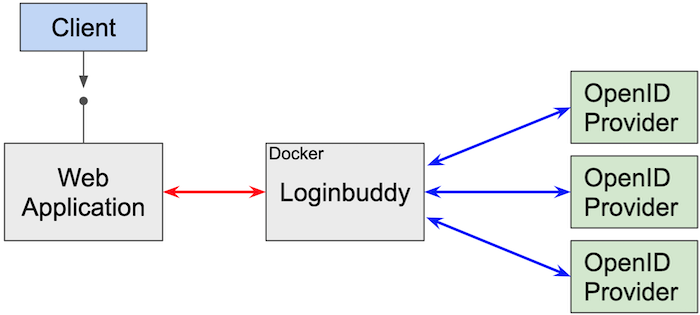

# About

A container based solution that helps developers support social login for their applications in a simple way!

The latest docker image is always available at [docker hub](https://hub.docker.com/r/saschazegerman/loginbuddy/).

A running version of the latest Loginbuddy may be here: [http://latest.loginbuddy.net](http://latest.loginbuddy.net). (If the URL is not working, I am trying to figure out something new)

# Loginbuddy - Your authenticator

This project implements an OpenID Connect client that can be used as proxy between an application (your application) and 
an OpenID Provider. This is useful for cases where social login should be an option for users to login to your 
application. Your application only needs to communicate with Loginbuddy. After finishing the authentication and authorization 
with providers, Loginbuddy provides single response to the application.

The high level design looks like this:



# Getting started

## Running the latest and greatest container of Loginbuddy

The sample setup consists of Loginbuddy, a sample web application and a sample OpenID Provider. The instructions are 
made for Docker on a MacBook and may need to be adjusted for windows users.

- Preparation
  - modify your hosts file, add **127.0.0.1 local.loginbuddy.net demoserver.loginbuddy.net democlient.loginbuddy.net**
  - for MacBooks this would be done at ```sudo /etc/hosts```
- Run ```docker run -p 80:80 -p 443:443 -d saschazegerman/loginbuddy:latest-demo```
  - this will pull the latest demo image from docker hub
  - this will use ports 80 (http), 443 (https)
- Open a browser
  - go to **https://democlient.loginbuddy.net** and follow the prompts

The demo simulates a client, a social login provider (called 'fake') and uses Loginbuddy!

The last page displays the type of message Loginbuddy would return to your application. (the window is very small. Copy the content, paste it into [JSONLINT](https://jsonlint.com) and click 'Validate JSON').

Since the demo uses self-signed certificates, confirm the SSL security screens in your browser.

# Current state

To find out more details on how to configure and build Loginbuddy, please visit the [WIKI](https://github.com/SaschaZeGerman/loginbuddy/wiki) pages!

Please check the project page to find out what is planned for the future and what has been done so far: [projects](https://github.com/SaschaZeGerman/loginbuddy/projects).

# License

Copyright (c) 2019. All rights reserved.

This software may be modified and distributed under the terms of the Apache License 2.0 license. See the [LICENSE](/LICENSE) file for details.